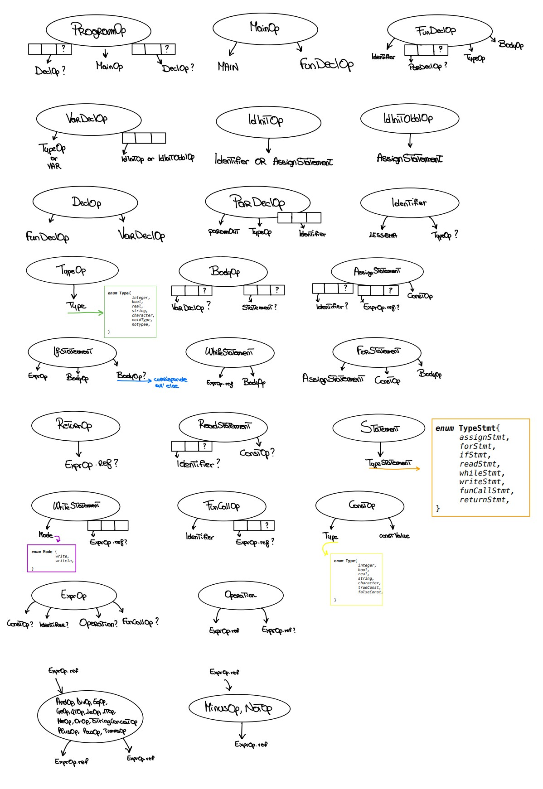

# 💻 Esercitazione 5

```
    ---------------------------------------------------
        
    👩🏾‍💻 Esposito Mariarosaria
          📧 m.esposito281@studenti.unisa.it
          
    👩🏾‍💻 Perillo Francesca
          📧 f.perillo11@studenti.unisa.it
          
    ---------------------------------------------------
    
    🧑🏾‍🏫 Gennario Costagliola 
    
    ---------------------------------------------------
    
    📅 A.A. 2022/2023
    
    ---------------------------------------------------
```

    -----------------------------------------------
                    📢 NOTA BENE.
    -----------------------------------------------
      TUTTO CIO' CHE CONCERNE GESTIONE DELLO
      SCOPING, INFERENZA DI TIPO E TYPE
      CHECKING VIENE RIPORTATO NELL'APPOSITA
      DOCUMENTAZIONE RICHIESTA PER IL PROGETTO. 
    ------------------------------------------------

👉🏼 [Clicca qui](documentation.pdf) 👈🏼 per accedere facilmente alla documentazione in formato pdf!

# Struttura del progetto 
Di seguito viene riportata una breve panoramica della struttura del progetto.

    📂 img 
        📢 vengono storicizzate le immagini, utili per il readme.md
    📂 src 
        📂 main
            📁 generated
                📢 vengono salvati tutti i file generati da altri file!
            📁 java
                📢 classi main, se ne discute nel capitolo Main classes
            📁 visitor
                📁 utility
                      📢 classi utili ai visitors, come la tabella di compatibilità e così via
                📄 CGenerator.java
                📄 VisitorGenerateTreeXML.java
                📄 VisitorSementic.java
        📁 nodi
            📢 classi che rappresentano i nodi dell'albero
        📁 test
            📢 nostre classi di test, discusse nei capitoli che seguono
    📂 srcjflexcup
        📄 GeneratoreLessicale.flex
        🍵 GeneratoreSintattico.cup
    📂 tests
        📢 classi di test fornite dal docente

All'interno della documentazione correlata al progetto verranno approfonditi alcuni aspetti della
struttura del progetto, specificando il contenuto della cartella `📁 utility/..` per una completa comprensione
della gestione dello scoping e dell'implementazione delle regole di tipo.

# Cambiamenti alla grammatica
La grammatica originale è stata modificata eliminando ogni traccia di epsilon condition. 
Le produzioni che hanno portato alla modifica sono evidenziate di seguito:

```
*****************************************************************************
**************** Produzioni con epsilon prima della modifica ****************
*****************************************************************************

Program ::= DeclList MainFunDecl DeclList
DeclList ::= VarDecl DeclList | FunDecl DeclList | /* empty */
MainFunDecl ::= MAIN FunDecl

ParamDeclList ::= /*empty */ 
	| NonEmptyParamDeclList

VarDeclList -> /* empty */ 
	| VardDecl VarDeclList

Stat ::= IfStat 
	| ForStat 
	| ReadStat SEMI
	| WriteStat SEMI
	| AssignStat SEMI
        | WhileStat 
	| FunCall SEMI
	| RETURN Expr SEMI
	| RETURN SEMI
	| /* empty */

Else ::= /* empty */ 
	| ELSE Body

```

L'intera grammatica dopo la modifica, risulta essere così formata.
```
Program  ::= DeclList MainFunDecl DeclList
          | MainFunDecl DeclList                    
          | DeclList MainFunDecl                   
          | MainFunDecl                               


DeclList ::= VarDecl DeclList                                          
          | VarDEcl	
          | FunDecl	DeclList                                                
          | FunDecl

MainFunDecl ::=	MAIN FunDecl

VarDecl ::= Type IdInitList SEMI
         | VAR IdInitObblList SEMI

Type ::= INTEGER   
      | BOOL        
      | REAL        
      | STRING      
      | CHAR       

IdInitList ::= ID
            | IdInitList COMMA ID 
            | ID ASSIGN Expr
            | IdInitList COMMA ID ASSIGN Expr

IdInitObblList ::= ID ASSIGN Const
                | IdInitObblList COMMA ID ASSIGN Const

Const ::= INTEGER_CONST
       | REAL_CONST
       | TRUE   
       | FALSE              
       | STRING_CONST
       | CHAR_CONST
;

FunDecl ::= DEF ID LPAR ParamDeclList RPAR COLON TypeOrVoid Body
          | DEF ID LPAR RPAR COLON TypeOrVoid Body

Body ::= LBRAC VarDeclList StatList RBRAC 
       | LBRAC StatList RBRAC                 
       | LBRAC VarDeclList RBRAC            
       | LBRAC RBRAC                   


ParamDeclList ::= NonEmptyParamDeclList 

NonEmptyParamDeclList ::= ParDecl
                        | NonEmptyParamDeclList PIPE ParDecl
                                                                      

ParDecl ::=     Type IdList
          | OUT Type IdList

TypeOrVoid ::= Type
             | VOID  

VarDeclList ::= VarDecl          
              | VarDecl VarDeclList

StatList ::= Stat         
           | Stat StatList

Stat ::= IfStat
       | ForStat
       | ReadStat
       | WriteStat
       | AssignStat
       | WhileStat
       | FunCall
       | RETURN Expr SEMI    
       | RETURN SEMI               
;

IfStat ::= IF Expr THEN Body Else 
         | IF Expr THEN Body         
;

Else ::= ELSE Body

WhileStat ::= WHILE Expr LOOP Body 

ForStat ::= FOR ID ASSIGN INTEGER_CONST TO INTEGER_CONST LOOP Body 

ReadStat ::= IdList READ STRING_CONST 

IdList ::= ID             
         | IdList COMMA ID 

WriteStat ::= LPAR ExprList RPAR WRITE  
            | LPAR ExprList RPAR WRITELN 

AssignStat ::=  IdList ASSIGN ExprList  

FunCall ::= ID LPAR ExprList RPAR 
          | ID LPAR RPAR        

ExprList ::= Expr 
           | Expr COMMA ExprList  

Expr ::= TRUE                       
       | FALSE                       
       | INTEGER_CONST          
       | REAL_CONST
       | STRING_CONST
       | CHAR_CONST
       | ID
       | FunCall
       | Expr  PLUS Expr
       | Expr  MINUS Expr
       | Expr  TIMES Expr
       | Expr  DIV Expr
       | Expr  AND Expr
       | Expr  POW Expr
       | Expr  STR_CONCAT Expr
       | Expr  OR Expr
       | Expr  GT Expr
       | Expr  GE Expr
       | Expr  LT Expr
       | Expr  LE Expr
       | Expr  EQ Expr
       | Expr  NE Expr
       | MINUS Expr
       | NOT Expr
       | LPAR Expr RPAR     
```
Occorre notare che nonostante la rimozione delle epsilon condition,
la grammatica risulta essere equivalente alla precedente.

# Specifica alberi sintattici
Di seguito vengono riportati i diagrammi per la specifica degli alberi sintattici,
presenti anche nella quarta esercitazione.



👉🏼 [Clicca qui](tree.pdf) 👈🏼 per accedere facilmente al formato pdf!

# Gestione dello scope
Per quanto concerne la gestione dello scope sono state utilizzate varie classi java, presenti al path:
```
📂 src
  📂 main
    📂 visitor
      📂 utility
        📄 Element
        📄 ElementMethod
        📄 ElementVar
        📄 SymbolTable
        📄 TypeEnvironment
        📄 ...
```
La tabella dei simboli è gestita dalla classe `SymbolTable.java` e vede l’utilizzo di un
HashMap<String, Element>. La classe Element viene estesa da due altre classi: `ElementMethod.java` e
`ElementVar.java` a seconda se l'elemento da aggiungere sia rispettivamente un metodo o una variabile.
La tabella dei simboli è una entry del TypeEnvironment, gestito dall'omonima classe `TypeEnvironment.java`, 
che fa uso di un da uno Stack di SymbolTable. Questa classe contiene metodi per la gestione dello scope
([si riporta alla documentazione associata](documentation.pdf) per una visione più approfondita dei metodi
utilizzati per la gestione dello scope).

Occorre notare che _NewLang_ permette l'utilizzo di una _variabile_ e di una _funzione_ anche prima della loro dichiarazione.
Per permettere ciò sono state rispettivamente utilizzate due diverse strutture dati:

- una `HashMap<String,String>`, nel caso di una variabile. La chiave è il nome della variabile stessa; mentre il valore è il suo Tipo.
- un `ArrayList<String>`, nel caso di una funzione. La stringa rappresenta il nome della funzione.

Nel momento in cui una variabile viene utilizzata viene fatto un primo check facendo la `.lookup()`, se non è stata ancora dichiarata
allora viene aggiunta all'`HashMap<String, String>` e viene rimossa solo nel momento in cui viene effettivamente dichiarata. 
Per verificare che tutte le variabili utilizzate siano effettivamente state anche dichiarate, un ultimo controllo viene effettuato 
alla fine dell'esecuzione. Se l'`HashMap<String,String>` allora vuol dire che tutte le variabili sono state dichiarate; altrimenti 
l'esecuzione terminerà con un errore.

Per quanto invece riguarda le funzioni, la gestione è simile. 

# ▶ Main classes 
In totale nel progetto sono presenti tre classi main nel path `main/java/..`:

    📂 main
        📂 java
            📄▶ NewLang2C
            📄▶ TesterLexer
            📄▶ TesterParser

- `📄TesterLexer` per ottenere l'output dell'analisi lessicale;
- `📄TesterParser` per ottenere l'output dell'analisi sintattica e semantica. 
- `📄NewLang2C` per ottenere gli output dei vari casi di test presenti al path
  `test_files/..`

In questa esercitazione viene eseguita la classe `📄▶TesterParser`.
```
💾 ▶ Per eseguire il programma di prova di NewLang occorre lanciare la configurazione programma
```

Per testare il codice C generato dalla classe main 📄NewLang2C
è stato utilizzato il seguente [compilatore online](https://www.onlinegdb.com/online_c_compiler).

# File di Test
In questo capitolo verranno illustrati prima i nostri casi di test che abbiamo utilizzato per il testing di questa esercitazione;
poi i casi di test che ci sono stati forniti dal docente per la _Continuous Integration_. 
## Nostri casi di test 
In questo paragrafo vengono riportati e spiegati i casi di test utilizzati nel corso
della seguente esercitazione prima di ricevere i test forniti dal docente.
E' possibile visionare tali casi di test al path:

    📂 src
        📂 test
            📂 testFAIL
                📂 declFail
                    📄 ...
                    📄 Test_[n]
                    📄 ...
                📂 methodFail
                    📄 ...
                    📄 methodT[n]
                    📄 ...
            📄 Programma.txt
   
Nella cartella `📁 declFail/..` sono riportati nello specifico i seguenti casi di errore: 

* `📄 Test_01`. Si sta tentando di fare l'assegnazione fra due tipi differenti (string e integer);
* `📄 Test_02`. Tipo atteso e tipo effettivo di una data variabile non corrispondono;
* `📄 Test_03`. Si sta tentando di utilizzare un identificatore specifico senza che questo sia mai stato dichiarato;

Nella cartella `📁 methodFail/..` sono riportati nello specifico i seguenti casi di errore:

* `📄 methodT2`. La funzione esecuzione() viene chiamata con un numero diverso di parametri;
* `📄 methodT3`. So sta tentando di dichiarare due funzioni identiche. 
* `📄 methodT4`. Si tenta di usare una funzione senza che la dichiarazione della funzione stessa esista. 

Il file `../📄 Programma.txt` contiene tutto ciò che è stato richiesto dal docente, ovvero
```
("2. Addizione") -->!;
("3. Sottrazione") -->!;
("4. Moltiplicazione usando la somma") -->!;
("5. Divisione intera fra due numeri positivi") -->!;
("6. Elevamento a potenza") -->!;
("7. Successione di Fibonacci") -->!;
```

Per vedere l'esecuzione di ogni file di test, sono presenti delle configurazioni che seguono
il nome degli stessi files di test. 
## Casi di test forniti dal docente
In questo paragrafo vengono riportati i bug riscontrati durante l'esecuzione dei test forniteci dal docente e
il mondo in cui questi sono stati risolti. I file sono situati nella cartella `📁 tests/..`.

    📂 tests
        📂 invalid_xxx
            📄 invalid_xxx.txt
        📂 valid[n]
            📄 valid[n].txt
            📄 valid[n]_in.txt
            📄 valid[n]_out.txt

### ✖️📄 Invalid Test Files
I file con prefisso `invalid_` rientrano tutti in situazioni di errore che riprendono il nome del file stesso (`xxx` nell'esempio riportato sopra). 
Oltre ciò, tali file contengono informazioni aggiuntive, ad esempio, come evince della pipeline, per il test
`📄 invalid_missingfunction` l'errore corrisponde al nome del file (Missing Function), ma oltre ciò viene riportata una informazione
aggiuntiva circa il nome della funzione che non esiste. 

```
Test name: tests/invalid_missingfunction
mvn --batch-mode -q exec:java -Dexec.args=tests/invalid_missingfunction/invalid_missingfunction.txt
java.lang.Error: Missing Function. 
VisitorSemantic - La funzione - potenza() - non esiste.
	at main.visitor.VisitorSemantic.visit(VisitorSemantic.java:79)
	at nodi.ProgramOp.accept(ProgramOp.java:81)
	at main.java.NewLang2C.main(NewLang2C.java:31)
	at org.codehaus.mojo.exec.ExecJavaMojo$1.run(ExecJavaMojo.java:254)
	at java.base/java.lang.Thread.run(Thread.java:833)
```
Oltre ciò, `📄 invalid_toomanyparm`, `📄 invalid_wrongparameternumber` 
e `📄 invalid_wrongparaumber` forniscono un Error diverso dal nome del file stesso in quanto per
tutti questi l'errore risulta essere "Wrong Param Number". Ancora, `📄 invalid_wrongoutuse` 
fornisce un Error diverso da "Wrong out use". Di seguito ne viene riportato un esempio:

```
------------------------
📄 invalid_wrongoutuse
------------------------
Test name: tests/invalid_wrongoutuse
mvn --batch-mode -q exec:java -Dexec.args=tests/invalid_wrongoutuse/invalid_wrongoutuse.txt
java.lang.Exception: VisitorSemantic - TypeChecking_ERROR.
Errore di compatibilita' fra i tipi in
- tipo 1: string
- operazione: PLUS 
- tipo 2: integer

------------------------
📄 invalid_toomanyparm
------------------------
Test name: tests/invalid_toomanyparm
mvn --batch-mode -q exec:java -Dexec.args=tests/invalid_toomanyparm/invalid_toomanyparm.txt
java.lang.Error: Wrong param number.
VisitorSemantic. La funzione potenza() viene chiamata con un numero diverso di parametri:
- numero di parametri attesi: 3
- numero di parametri con cui viene chiamata: 2

-------------------------------
📄 invalid_wrongparameternumber
-------------------------------
Test name: tests/invalid_wrongparameternumber
mvn --batch-mode -q exec:java -Dexec.args=tests/invalid_wrongparameternumber/invalid_wrongparameternumber.txt
java.lang.Error: Wrong param number.
VisitorSemantic. La funzione potenza() viene chiamata con un numero diverso di parametri:
- numero di parametri attesi: 2
- numero di parametri con cui viene chiamata: 1

-------------------------
📄 invalid_wrongparaumber
-------------------------
Test name: tests/invalid_wrongparamnumber
mvn --batch-mode -q exec:java -Dexec.args=tests/invalid_wrongparamnumber/invalid_wrongparamnumber.txt
java.lang.Error: Wrong param number.
VisitorSemantic. La funzione succ_fibonacci() viene chiamata con un numero diverso di parametri:
- numero di parametri attesi: 0
- numero di parametri con cui viene chiamata: 1
```

### ✔️📄 Valid Test Files
I files con prefisso `valid` devono fornire un codice C che, compilato ed eseguito con gli input 
presenti nei files `📄 valid[numero]_in.txt`, devono fornire in output il contenuto dei files
`📄 valid[numero]_out.txt`. Di seguito vengono riportate tutte le modifiche necessarie al file di permettere la corretta
compilazione del codice in C.

#### 📄 valid1.txt

Testando questo file ci siamo rese conto della mancanza di una regola di compatibilità tra i tipi `string`.
Quest'ultima è stata inserita nella classe
   
     📂 src
        📂 main
            📂 visitor
                📂 utility
                    📄 CompatibilityTables.txt
che gestisce la tabella di compatibilità. I due metodi principali per la gestione della tabella di compatibilità
sono i seguenti
```java
/**
 * Metodo che implementa la tabella di compatibilità per opType1:
 * operatori unari.
 * T |- e:t1       optype1(op1,t1) = t
 * -----------------------------------
 *      T |- op1 e : t
 * @param operazione
 * @param tipoOperando
 * @return
 */
public TypeOperation optype1(OpType operazione, String tipoOperando)
{...}
```
```java
/**
* Metodo che implementa la tabella di compatibilità per opType2:
* operatori binari.
*  T |- e1:t1     T |- e2:t2      optype2(op2,t1,t2) = t
*  ------------------------------------------------------
*               T |- e1 op2 e2 : t
* @param operazione tipo di operazione che si deve svolgere
* @param tipoOperando1 tipo del primo operando
* @param tipoOperando2 tipo del secondo operando
* @return tipo risultante
*/
public TypeOperation optype2(OpType operazione, String tipoOperando1, String tipoOperando2)
{...}
```

dove `optype1(...)` e `optype2(...)` rappresentano rispettivamente le tabelle di compatibilità riportate 
all'interno della documentazione correlata al suddetto progetto. 

Inoltre, per quanto concerne gli identificatori, il pattern è stato modificato nel modo che segue
```
➖ from:     identifier = [A-Za-z][A-Za-z0-9]*
            
➕   to:     identifier = [A-Za-z][\_A-Za-z0-9]*
            
```
in modo da consentire che un id potesse contenere il carattere speciale `_ (trattino basso)`

#### 📄 valid2.txt
In questo caso di test la funzione main viene richiamata, cosa non gestita prima di lanciare questo test, motivo per cui
la classe `📄 CGenerator.java` ha subito una modifica. Considerando il caso specifico del secondo file di test valido
```
start:
def stampa(string messaggio): void {
    integer a;
    integer i;
	for x << 4 to 1 loop {
		("") -->! ;
	}
	(messaggio) -->! ;
}
```
il codice C avrà la dichiarazione di una funzione `void stampa(string messaggio) {...}` e un main
contenente nel proprio body la dichiarazione di una stringa messaggio (paraertro passato alla funzione stampa). 

#### 📄 valid5.txt and valid6.txt
Sono state inserite le regole di compatibilità per permettere la concatenazione
anche quando il primo argomento è una stringa e il secondo è un intero o un real.

```
--------------------------------------------------
                📢 NOTA BENE.
--------------------------------------------------
  LA NOSTRA IMPLEMENTAZIONE NON PREVEDE LA 
  CONCATENAZIONE CON I VALORI DI RITORNO DELLE 
  FUNZIONI. PER EFFETTUARE TALE CONCATENAZIONE, 
  E' NECESSARIO SALVARE IL VALORE DI RITORNO  
  DELLA FUNZIONE IN UNA VARIABILE. 
---------------------------------------------------
Esempio. 

✖️  
      stampa("la somma fra a e b è: " & somma(a,b));

✔️
      float c << somma(a,b);
      stampa("la somma fra a e b è: " & c);

```    

#### 📄 valid9.txt and valid10.txt
In questo caso, il problema era dovuto ad un errore lessicale dato dal non riconoscimento di alcuni
caratteri speciali all'interno della sezione dedicata ai commenti. Per tale motivo, nell'analizzatore
lessicale la gestione dei commenti è stata modificata permettendo a questi ultimi di contenere la maggior
parte dei caratteri speciali consentiti. 

```
➖ from:  /* comments */
          CommentMoreLine = "|*"({identifier}|{integer}|{whitespace}|"'")*"|"
          CommentLine = "||"({identifier}|{integer}|{whitespaceNoLN}|"'")*{ln}

➕   to:  accented = à|è|é|ì|ò|ù 
          special = _|-|\!|\"|£|%|&|\/|\(|\)|=|\?|\^|,|\.|;|:|°|#|@|ç|\{|\}|\[|\]|\*|\+|§|<|>|\/|\\
          
          /* comments */
          CommentMoreLine = "|*"({identifier}|{integer}|{whitespace}|"'"|{accented}|{special})*"|"
          CommentLine = "||"({identifier}|{integer}|{whitespaceNoLN}|"'"|{accented}|{special})*{ln}
```

# Lessemi riservati
Per la generazione del codice C vengono utilizzati delle variabili temporanee utili al fine
della corretta generazione del codice. 

Pertanto, tali variabili NON possono essere utilizzate nella scrittura del codice NewLang, tali variabili sono le seguenti:

* `MAXDIM` utilizzata per settare la dimensione dei buffer di caratteri;
* `concat_[n]` e  `buffer_bis_[n]`, con n>0, utilizzata per la gestione della concatenazione;
* `v_tmp_[n]`, con n>0, utilizzata per la gestione di variabili temporanee utili come variabili di appoggio.